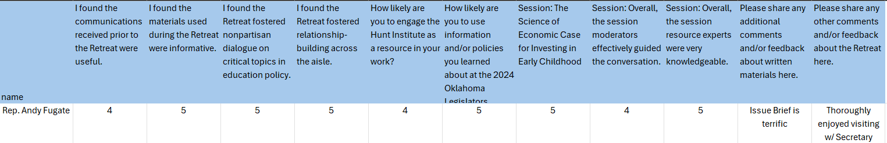

# Standard Operating Procedure (SOP) for Processing Paper Surveys for Events

### Document Control

SOP Number: [Insert Number]  
Version: [Insert Version]  
Effective Date: [Insert Date]  
Review Date: [Insert Date]  
Prepared By: [Insert Name/Position]  
Approved By: [Insert Name/Position] 

## 1. Purpose
This SOP outlines the procedures for processing paper surveys collected during events, including digitization and data management. The goal is to ensure accurate and efficient data handling for analysis and reporting.

## 2. Scope 
This procedure applies to all staff involved in collecting, processing, and analyzing paper surveys for events.

## 3. Responsibilities
Event Coordinator: Ensure surveys are collected and stored properly.
Data Entry Personnel: Responsible for digitizing the paper surveys.
Quality Control: Review the digitized data for accuracy.

## 4. Materials Needed
Paper surveys
Scanning device (scanner or mobile app)
Computer with data entry software (e.g., Excel, Google Sheets)
Data cleaning tools (if applicable)
Backup storage (cloud or external hard drive)

## 5. Procedure 
### 5.1 Collecting Paper Surveys 
Ensure surveys are completed fully by participants.
Collect surveys at the end of the event or designated collection points.
Store surveys securely in a designated area to prevent loss or damage.
### 5.2 Preparing for Digitization (not done)
* Create excel sheet to compile responses
  * include all respondents and their responses
  * should include columns for:
     * Respondant name
     * Respondent type
       * should fall under the current list
          * Legislator
          * Executive Official
          * Education Leader
     * Question₁ - Questionₙ headers
       * fill out questions based on how you would like them to be displayed.
       * see guidelines below for more info on how to format question headers

#### 5.2.1: File upload Values
| Column | Column Header | Accepted Row Values | 
| -------- | -------- |  -------- |
| Name | "name", "respondent" | name or "anonymous"
| Type | "Type" | Respondent type (legislator, executive official, education leader, other)
| Other | | Only fill in if Type is "other"
| Questionₙ | [Question as you would like displayed]    for Session Rating: "Session Rating: [Session name]"    Material Rating: "Material Rating: [Material name]"   | Quantitative Values: Likert scale (1-5)    Qualitative Values: Text

#### 5.2.1: Example

 

Check Completeness: Ensure all surveys are complete and legible. Remove any surveys that are damaged or unusable.
Organize Surveys: Sort surveys by type or session to streamline data entry.
### 5.3 Digitization Process

Scanning:
Use a scanner or a mobile app to digitize each paper survey.
Save scanned files in a designated folder on your computer.
Choose a file format (e.g., PDF, JPG) that maintains clarity.
 
Data Entry:
Open the digitized survey in your data entry software.
Input responses accurately, following the survey structure.
Use drop-down lists or checkboxes for standardized responses to minimize errors.

### 5.4 Data Cleaning
Review the entered data for accuracy.
Correct any discrepancies or errors found during the review.
Remove duplicates if applicable.
### 5.5 Data Submission 
Save the finalized dataset in an accessible and secure location.
Back up the data regularly (e.g., weekly) to prevent loss.
### 5.6 Analyzing Data 
Prepare the data for analysis based on event objectives.
Use appropriate statistical methods and tools to analyze responses.
### 5.7 Reporting Results 
Compile the findings into a report or presentation.
Share the results with relevant stakeholders in a timely manner.
## 6. Considerations for Digitizing Paper Surveys 
Legibility: Ensure that handwriting is clear and easily readable to avoid misinterpretation.
Data Privacy: Protect sensitive information in compliance with privacy regulations (e.g., GDPR).
Format Consistency: Maintain consistency in how data is entered to facilitate analysis (e.g., use the same units or scales).
Training: Provide training for personnel on how to digitize and enter data accurately.
Feedback Loop: Implement a process for staff to report issues or suggest improvements to the digitization process.
## 7. Review and Revisions 
This SOP should be reviewed annually or as needed to incorporate improvements or changes in technology.

Version Log